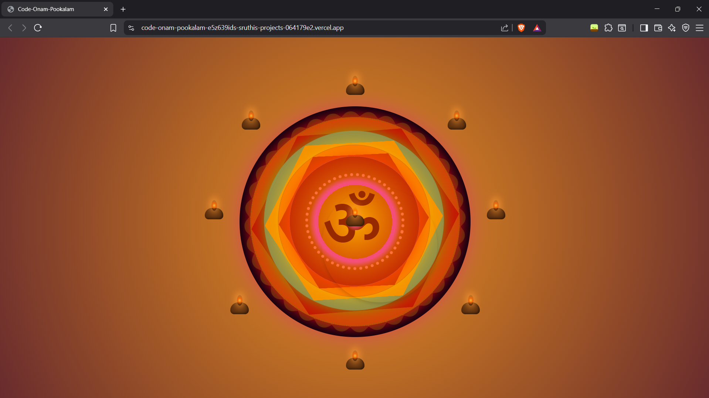

# 🌸 TinkerHub SBCE – Code-a-Pookkalam 🌸
https://code-onam-pookalam-1.vercel.app/

Pookkalam is a timeless tradition of Onam — colorful floral patterns that bring people together in creativity and joy.
But this time, we’re mixing tradition with tech. Instead of petals, we’re using pixels. Instead of flowers, we’re using code.

Welcome to **Code-a-Pookkalam**, where art meets HTML & CSS! 🎨💻

---

## 🎯 What is Code-a-Pookkalam?

It’s a fun activity where you design your own digital pookkalam using **HTML + CSS**.
Don’t worry if you’re not a pro at design — this is all about experimenting, learning, and creating something unique.

---

## 🚀 Getting Started

### 1. Fork this repository

Click the **Fork** button on the top right.

### 2. Clone your fork

```bash
git clone https://github.com/Tinkerhub-SBCE/CODE-A-POOKALAM-TEMPLATE.git
cd code-a-pookalam
```

### 3. Start coding!

**🖥️ My Design Implementation**

1. **HTML Structure:**
I’ve created a basic HTML structure in the index.html file. The key elements are:

    A container (<div class="pookkalam">) that holds the entire pookkalam pattern.

    Several <div> elements within this container to represent individual segments of the design.

2. **CSS Styling:**
The styles are in styles.css. Some key features:

    Colorful Gradients: I used linear gradients to fill the pookkalam with vibrant colors.

    Geometric Patterns: Different CSS techniques like border-radius, transform, and animation have been used to create symmetrical patterns and smooth transitions.

3. **Animations:**
I added a subtle animation to make the pookkalam feel more dynamic. It’s based on rotating elements and a gentle scaling effect to mimic the organic feel of traditional pookkalams.



## 🌼 Rules / Guidelines

* Use **only HTML & CSS** (no images, no frameworks).
* Be creative — geometric patterns, gradients, animations… it’s your pookkalam!
* Submit your project via provided form or through TinkerHub App.

---

## 📚 Resources

* [Guide: How to Code a Pookkalam](https://code-a-pookalam-tinkerhub-sbce.vercel.app/)
* [Fun Git/GitHub Tutorial](https://thecompletegitguide.netlify.app/)
* Need inspiration? Google "Onam Pookkalam patterns" 🌸

---

## 🎉 Why Join?

* Celebrate Onam in a whole new way.
* Learn Git/GitHub hands-on.
* Show off your creativity to the TinkerHub SBCE community.
* And of course… have fun! ✨

---

## 🪷 Made with ❤️ by TinkerHub SBCE

*"Learning by doing, celebrating by coding."*

---
